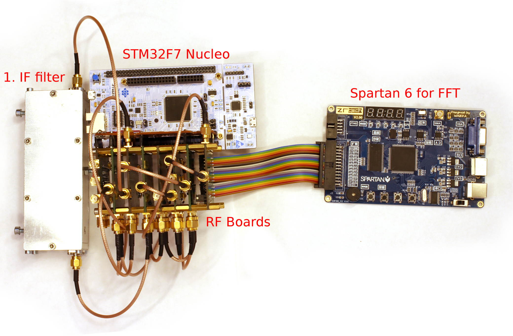
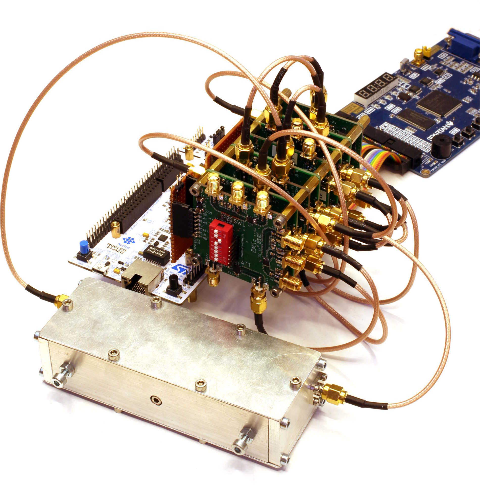
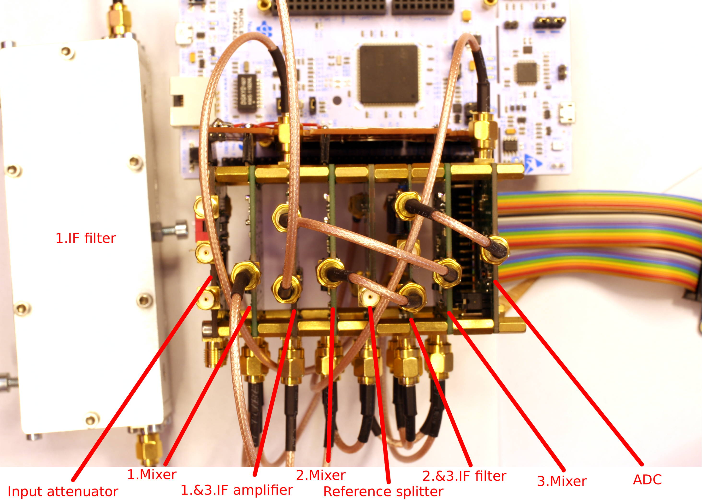
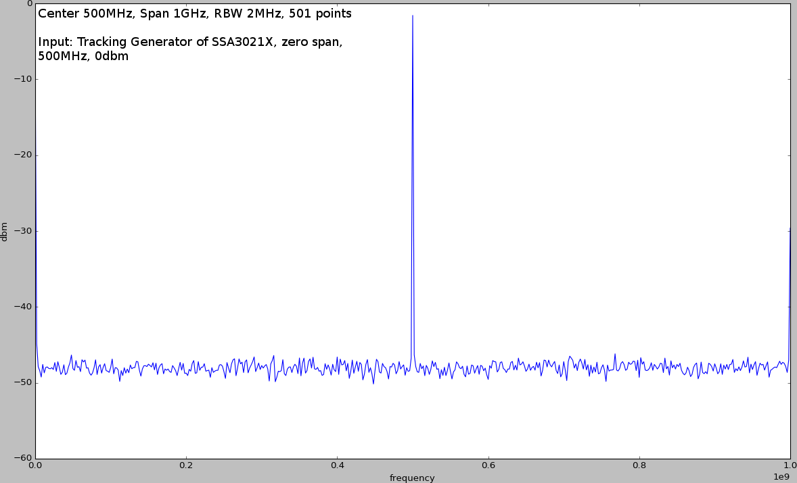
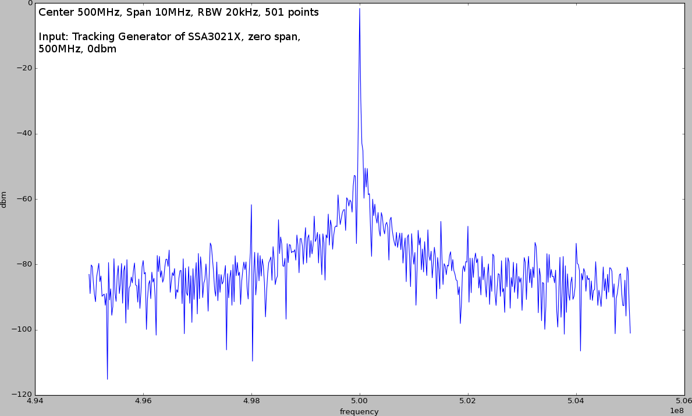
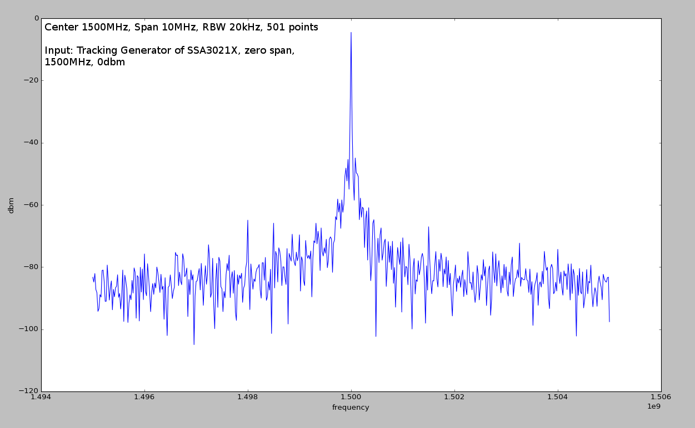

# SpectrumAnalyzer
It started as some general experiments with RF stuff and gradually evolved into a (severely limited) spectrum analyzer. 

The main work is in the RF boards, consisting of various mixers, filters and amplifiers. Everything is controlled with an STM32F7 Nucleo board. As the MCU is not quite powerful enough to handle the digitized final IF (14bit@25MHz) it is supported by a Spartan6 FPGA (actually, the STM is fast enough to *sample* the ADC but not fast enough to calculate the FFT on the fly and lacks the memory to store all samples for a later calculation).

Originally, the plan was to add a display, some buttons and a case and actually use it as a home-built spectrum analyzer. Ironically I had to buy a spectrum analyzer to solve some problems while building this setup. Now that I have a SSA3021X sitting on the bench, I don't think I can come up with the motiviation to finish this thing. It does work, it is just not very usable (e.g. hard coded values for span, resolution bandwidth,...)

Frequency plan:

* Input: 5MHz-1.8GHz
* 1.IF: 2.15GHz
* 2.IF: 403MHz
* 3.IF: 18.75MHz

And some measurements (no calibration done, so amplitude is off by a few db):

